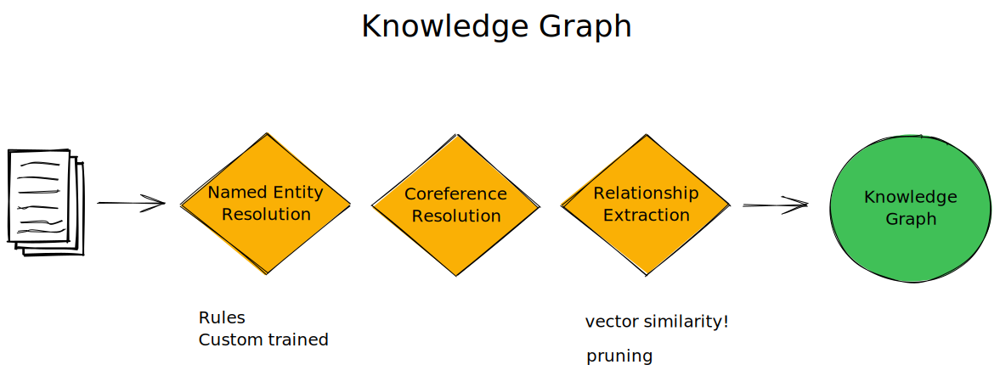

# Knowledge Graphs 

### What are knowledge graphs ? 
> Knowledge stored in a graph form. The knowledge is captured in entities, attributes, relationships. The Nodes represents entities, NodeLabels represents attributes, and Edges represents Relationships. 

- Example:  
> Chris Nolan (Director, Producer, person) ---> born in  ----> London (place) ---> Director of  ----> Interstellar (Movie) ---> shooted in  -----> Iceland (place)  

- Source of information for building knowledge graphs: 
> Structured Text: Wikipedia, DBpedia  
> Unstructured Text: Social Media, Blogs, Images, Videos, Audios 

### How are knowledge graphs constructed?

- Entity Extraction   
In this step, the aim is to extract right entities from the text data. spaCy provides NER (Named Entity Recognition) which can be used for this purpose.  

- Relationship Extraction    
In this step, the aim is to identify the relationship between the sentences / entities. Again, by using spaCy one can extract the grammar relations between two words / entities.  

- Relationship Linking    
The hard part of knowledge graphs is to identify what kind of relationship exists between the two entities. The idea is to add the contextual sense to the relationship. 

## References
- https://www.microsoft.com/developerblog/2016/09/13/training-a-classifier-for-relation-extraction-from-medical-literature/#Reuse
- https://github.com/bpostance/corpus-to-graph-ml
- https://stackoverflow.com/questions/44096918/how-to-implement-end-to-end-relation-extraction-using-lstms
- https://github.com/bpostance/LSTM-ER
- https://github.com/ProKil/FewRel
- https://www.aclweb.org/anthology/P16-1105.pdf
- https://www.reddit.com/r/MachineLearning/comments/bd4zrl/d_knowledge_graphs_how_do_you_build_your_own/
- https://medium.com/vectrconsulting/build-your-own-knowledge-graph-975cf6dde67f
- https://mnick.github.io/project/knowledge-graph-embeddings/
- https://databricks.com/session/deep-learning-for-domain-specific-entity-extraction-from-unstructured-text
- https://github.com/IBM/build-knowledge-base-with-domain-specific-documents
- https://github.com/thunlp/OpenKE
- https://ahmedbesbes.com/how-to-mine-newsfeed-data-and-extract-interactive-insights-in-python.html
 - [Ownership: E.g. Noun or Named Entity followed by: NNS/VBZ](https://sites.google.com/site/partofspeechhelp/home/nns_vbz)
 - [KG and pruning](http://philipperemy.github.io/information-extract/)
   - [git](https://github.com/philipperemy/information-extraction-with-dominating-rules)
 - [OLLIE](https://www.reddit.com/r/LanguageTechnology/comments/bovsf5/we_release_opiec_the_largest_open_information/)
 - [Clausie](https://github.com/mmxgn/clausiepy)
 - [Minie](https://github.com/mmxgn/miniepy/graphs/contributors)
 - [OpenNRE](https://github.com/thunlp/OpenNRE)
 - [neuralcoref](https://medium.com/huggingface/state-of-the-art-neural-coreference-resolution-for-chatbots-3302365dcf30)
 - https://github.com/tomasonjo/trinity-ie

temp:

https://www.kaggle.com/anshuljdhingra/spacy-text-meta-features-knowledge-graphs
https://www.analyticsvidhya.com/blog/2019/10/how-to-build-knowledge-graph-text-using-spacy/
https://towardsdatascience.com/from-text-to-knowledge-the-information-extraction-pipeline-b65e7e30273e
http://wikifier.org/submit.py
https://www.geeksforgeeks.org/python-program-to-find-indices-of-overlapping-substrings/
https://lei.info/portal/resources/semantic-lei-data/
https://towardsdatascience.com/visualizing-networks-in-python-d70f4cbeb259
https://blog.streamlit.io/the-streamlit-agraph-component/
